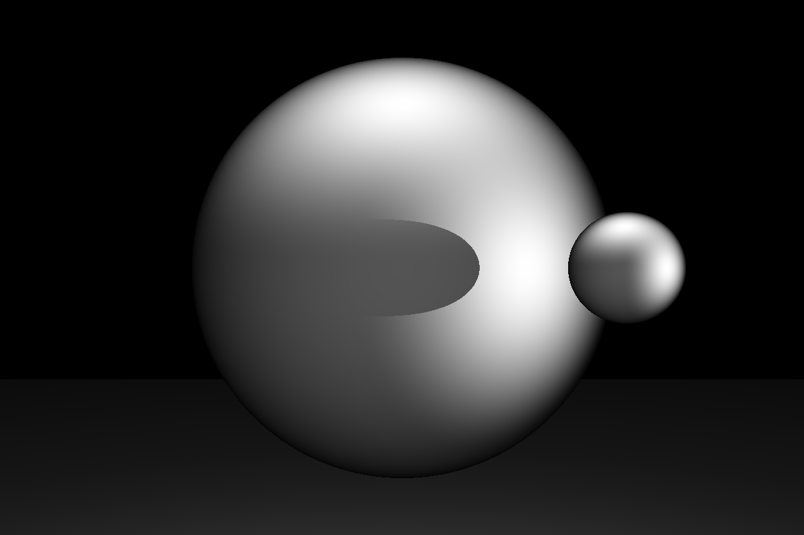

# Simple 3D Graphics Library

Based on a (likely naïve) way to draw 3D images I thought of. Produces passable results.

Examples are given in tests, such as a `draw_sphere` that includes a rectangle, two spheres and two light sources.

Single-threaded for now, might change that. `Triangle` and `Rectangle` could be faster.

